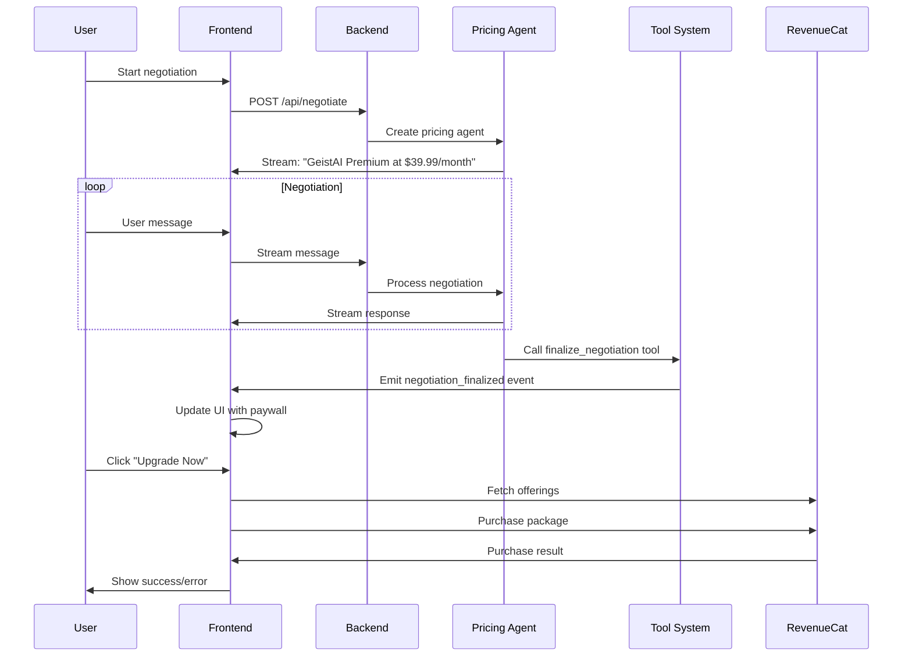

# GeistAI Pricing Negotiation Flow

## Overview

The GeistAI pricing negotiation system allows users to negotiate their subscription price through a conversational AI agent. The system presents three price points and uses a tool-based approach to finalize negotiations.

## Architecture

### Backend Components

1. **Pricing Agent** (`backend/router/prompts.py`)

   - Specialized AI agent for price negotiations
   - System prompt defines negotiation behavior and rules
   - Uses `finalize_negotiation` tool to conclude negotiations

2. **Negotiation Endpoint** (`backend/router/main.py`)

   - `/api/negotiate` - Streaming endpoint for price negotiations
   - Creates pricing agent using `create_custom_agent`
   - Streams real-time events to frontend

3. **Tool System** (`backend/router/gpt_service.py`)
   - `finalize_negotiation` tool for structured negotiation results
   - Emits `negotiation_finalized` events
   - Validates pricing data and package IDs

### Frontend Components

1. **NegotiationChat Component** (`frontend/components/NegotiationChat.tsx`)

   - Chat interface for price negotiations
   - Displays negotiation result and purchase button
   - Integrates with RevenueCat for purchases

2. **Chat Storage** (`frontend/hooks/useChatWithStorage.ts`)

   - Manages chat state and streaming
   - Handles `negotiation_finalized` events
   - Stores messages using modern `ChatMessage` format

3. **API Layer** (`frontend/lib/api/chat.ts`)
   - EventSource streaming for real-time updates
   - Processes `negotiation_finalized` events
   - Handles RevenueCat integration

## Negotiation Flow

### 1. User Initiates Negotiation

```
User → Frontend → /api/negotiate → Pricing Agent
```

- User opens negotiation chat
- Frontend calls `/api/negotiate` endpoint
- Backend creates pricing agent with centralized prompt
- Agent starts with $39.99/month presentation

### 2. Conversational Negotiation

```
User ↔ Pricing Agent (Streaming Chat)
```

**Agent Behavior:**

- Presents GeistAI Premium at $39.99/month
- Listens to user's negotiation arguments
- Responds conversationally (2-3 sentences)
- Considers user's reasoning and budget constraints

**Price Decision Logic:**

- **$39.99** (`premium_monthly_40`) - Weak negotiation, no reasoning
- **$29.99** (`premium_monthly_30`) - Decent negotiation, some reasoning
- **$19.99** (`premium_monthly_20`) - Strong negotiation, compelling arguments

### 3. Negotiation Finalization

```
Agent → finalize_negotiation tool → negotiation_finalized event → Frontend
```

**When Agent Finalizes:**

1. Agent announces final price to user
2. Agent calls `finalize_negotiation` tool with:
   - `final_price`: 19.99, 29.99, or 39.99
   - `package_id`: premium_monthly_20, premium_monthly_30, or premium_monthly_40
   - `negotiation_summary`: Brief explanation of decision

**Tool Execution:**

- Validates pricing data
- Emits `negotiation_finalized` event
- Returns success confirmation

### 4. Frontend Processing

```
negotiation_finalized event → Frontend State → UI Update
```

**Event Handling:**

1. Frontend receives `negotiation_finalized` event
2. Updates `negotiationResult` state
3. Shows paywall with negotiated price
4. Hides input bar (negotiation complete)

### 5. Purchase Flow

```
User → RevenueCat → Purchase → Premium Access
```

**Purchase Process:**

1. User clicks "Upgrade Now" button
2. Frontend fetches RevenueCat offerings
3. Finds matching package by `package_id`
4. Initiates RevenueCat purchase
5. Handles success/failure states

## Event Flow Diagram



## Key Features

### Tool-Based Architecture

- **No JSON parsing** - Uses structured tool calls
- **Event-driven** - Real-time updates via Server-Sent Events
- **Type-safe** - Validated pricing data and package IDs

### Centralized Prompts

- **Single source of truth** - All prompts in `prompts.py`
- **Easy maintenance** - Change behavior in one place
- **Consistent patterns** - Follows established architecture

### Modern Storage

- **Unified format** - Uses `ChatMessage` throughout
- **No legacy conversion** - Direct storage without format changes
- **Efficient streaming** - Real-time message updates

## Configuration

### Price Points

```typescript
const PRICE_POINTS = {
  premium_monthly_20: { price: 19.99, id: "premium_monthly_20" },
  premium_monthly_30: { price: 29.99, id: "premium_monthly_30" },
  premium_monthly_40: { price: 39.99, id: "premium_monthly_40" },
};
```

### Agent Configuration

```python
pricing_agent = create_custom_agent(
    name="pricing_agent",
    description="Specialized agent for pricing negotiations",
    system_prompt=get_prompt("pricing_agent"),
    model_config={},
    available_tools=["finalize_negotiation"],
    reasoning_effort="medium",
)
```

## Error Handling

### Backend Errors

- **Tool failures** - Graceful degradation with error messages
- **Streaming errors** - Proper cleanup and error events
- **Validation errors** - Invalid pricing data rejected

### Frontend Errors

- **Connection issues** - Retry mechanisms and fallbacks
- **Purchase failures** - Clear error messages and retry options
- **State management** - Consistent UI state across errors

## Testing

### Backend Testing

- Unit tests for pricing agent behavior
- Integration tests for tool system
- End-to-end tests for negotiation flow

### Frontend Testing

- Component tests for NegotiationChat
- Integration tests for RevenueCat flow
- E2E tests for complete user journey

## Future Enhancements

### Potential Improvements

1. **A/B Testing** - Different negotiation strategies
2. **Analytics** - Track negotiation patterns and success rates
3. **Personalization** - User-specific pricing based on usage
4. **Multi-language** - Localized negotiation experiences
5. **Advanced Logic** - More sophisticated pricing algorithms

### Scalability Considerations

- **Caching** - Agent responses and pricing data
- **Rate limiting** - Prevent abuse of negotiation system
- **Monitoring** - Track performance and success metrics
- **Analytics** - User behavior and conversion tracking

## Security

### Data Protection

- **No sensitive data** - Only pricing and negotiation context
- **Secure streaming** - HTTPS and proper authentication
- **Input validation** - Sanitize user inputs and tool parameters

### RevenueCat Integration

- **Secure purchases** - All payment processing through RevenueCat
- **Receipt validation** - Server-side purchase verification
- **Subscription management** - Proper entitlement handling

---

_This document describes the current implementation of the GeistAI pricing negotiation system. For technical details, refer to the source code in the respective files mentioned above._
